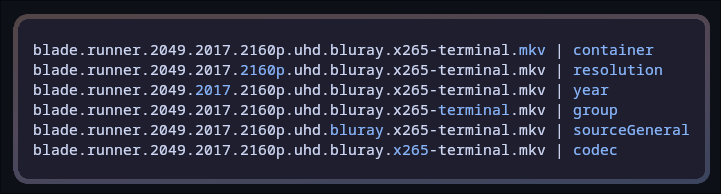

# Torrent Name Parser

Torrent name parser in Go

Do feel free to create issues with sane names that fail to parse properly

I've done a little clean up and increased the test coverage to ~95%

## Usage

```sh
go get github.com/ProfChaos/torrent-name-parser
```

```go
package main

import (
  "fmt"

  tnp "github.com/ProfChaos/torrent-name-parser"
)

func main() {
  torrent, err := tnp.ParseName("blade.runner.2049.2017.2160p.uhd.bluray.x265-terminal.mkv")
  if err != nil {
    fmt.Println(err)
    return
  }

  fmt.Printf("%+#v\n", torrent)
  fmt.Println(torrent.Title)
}
```

Output:

```sh
torrentparser.Torrent{Title:"blade runner 2049", AlternativeTitle:"", ContentType:1, Year:2017, Resolution:"4k", Extended:false, Unrated:false, Proper:false, Repack:false, Convert:false, Hardcoded:false, Retail:false, Remastered:false, Region:"", Container:"mkv", Source:"bluray", Codec:"x265", Audio:"", Group:"terminal", Season:-1, Seasons:[]int(nil), Episode:0, Languages:[]string(nil), Hdr:false, HdrTypes:[]string(nil), ColorDepth:"", Date:""}
blade runner 2049
```

### Binary

```bash
go install github.com/ProfChaos/torrent-name-parser/cmd/tnp@latest
```

```bash
tnp blade.runner.2049.2017.2160p.uhd.bluray.x265-terminal.mkv
```

```json
{"title":"blade runner 2049","alternativeTitle":"","contentType":1,"year":2017,"resolution":"4k","extended":false,"unrated":false,"proper":false,"repack":false,"convert":false,"hardcoded":false,"retail":false,"remastered":false,"region":"","container":"mkv","source":"bluray","codec":"x265","audio":"","group":"terminal","season":-1,"seasons":null,"episode":0,"languages":null,"hdr":false,"hdrTypes":null,"colorDepth":"","date":""}
```

#### Debug

If you want to check where in the name the parser found a certain value you can use the debug flag. This will highlight the text for each property.

```bash
tnp blade.runner.2049.2017.2160p.uhd.bluray.x265-terminal.mkv -debug
```

Output:


